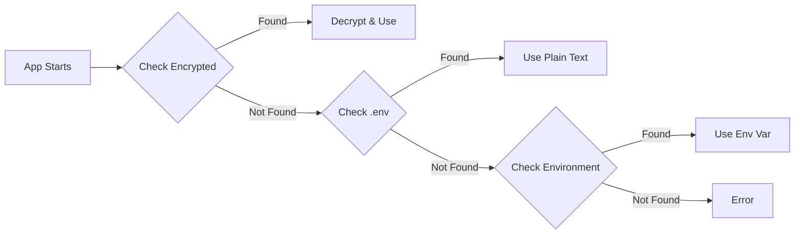

# API Key Encryption Guide

This system supports encrypted storage of API keys to enhance security. We provide two encryption methods:

1. **Python Cryptography** - Built-in using Fernet encryption (Recommended)
2. **ADE-Crypt** - Shell-based encryption tool (Alternative)

## Quick Start

### Step 1: Set Up Your API Keys

```bash
# Copy the example environment file
cp .env.example .env

# Edit .env and add your actual API keys
nano .env  # or use your preferred editor
```

### Step 2: Encrypt Your Keys

**Option A: Using Python Cryptography (Recommended)**
```bash
python -c "from src.utils.simple_crypto import get_secure_config; get_secure_config().encrypt_from_env()"
```

**Option B: Using ADE-Crypt**
```bash
# First install ADE-Crypt (one-time setup)
curl -sSL https://raw.githubusercontent.com/phdsystems/ade-crypt/main/lib/install.sh | bash

# Then encrypt your keys
./scripts/encrypt-api-keys.sh setup
```

### Step 3: Verify Encryption

```bash
# Verify your keys were encrypted successfully
./scripts/encrypt-api-keys.sh verify

# You should see output like:
# ✓ CLAUDE_API_KEY: ✓ (decryption successful)
# ✓ OPENAI_API_KEY: ✓ (decryption successful)
```

### Step 4: Secure Your .env File (IMPORTANT!)

After encryption, your plain text keys still exist in `.env`. Remove them for security:

```bash
# This script safely removes sensitive keys while preserving other settings
./scripts/secure-env.sh

# Review the secured file
cat .env.secured

# If everything looks good, replace your .env
mv .env.secured .env

# Optional: Remove the backup once you're confident
rm .env.backup.*
```

## Using Encrypted Keys in Code

The system automatically handles encrypted keys. Simply use:

```python
from src.utils.crypto_utils import get_api_key

# Get Claude API key (checks encrypted storage first, then environment)
claude_key = get_api_key("CLAUDE_API_KEY")

# With fallback to alternative environment variable
openai_key = get_api_key("OPENAI_API_KEY", fallback_env="ALTERNATE_OPENAI_KEY")
```

## Supported API Keys

The following API keys can be encrypted:
- `CLAUDE_API_KEY` - Anthropic Claude API
- `OPENAI_API_KEY` - OpenAI API
- `ALPHA_VANTAGE_API_KEY` - Alpha Vantage financial data
- `POLYGON_API_KEY` - Polygon.io market data
- `WEAVIATE_API_KEY` - Weaviate vector database
- `QDRANT_API_KEY` - Qdrant vector database

## What Happens to .env After Encryption?

### Before Encryption
```
.env contains:
├── CLAUDE_API_KEY=sk-ant-xxxxx (plain text)
├── OPENAI_API_KEY=sk-xxxxx (plain text)
└── OTHER_SETTINGS=values
```

### After Encryption (Step 2)
```
.env (unchanged - still has plain text keys!)
./config/encrypted/
├── CLAUDE_API_KEY.enc (encrypted)
├── OPENAI_API_KEY.enc (encrypted)
└── .encryption_key (encryption key)
```

### After Securing (Step 4)
```
.env (now secured)
├── # API keys removed
└── OTHER_SETTINGS=values (preserved)

.env.backup.timestamp (backup with original keys)
./config/encrypted/ (encrypted keys remain here)
```

## How the Application Reads Keys

The application follows this priority order:



## Security Notes

1. **Encryption Key Storage**: The encryption key is stored in `./config/.encryption_key` with restricted permissions (0600)
2. **Gitignore**: Encrypted files and keys are automatically excluded from version control
3. **Post-Encryption Security**: Always run `./scripts/secure-env.sh` after encryption to remove plain text keys
4. **Backup Safety**: The secure-env script creates timestamped backups before modifying .env
5. **Environment Fallback**: If encrypted keys aren't found, the system falls back to environment variables
6. **Placeholder Detection**: The system automatically ignores placeholder values like "your_api_key_here"

## Testing

Run the encryption tests:

```bash
# Test Python cryptography implementation
python test_simple_crypto.py

# Test the full encryption workflow
python test_encryption.py
```

## Complete Workflow Example

Here's a full example from start to finish:

```bash
# 1. Set up your environment
cp .env.example .env
echo "CLAUDE_API_KEY=sk-ant-api-key-here" >> .env
echo "OPENAI_API_KEY=sk-openai-key-here" >> .env

# 2. Encrypt your keys
python -c "from src.utils.simple_crypto import get_secure_config; get_secure_config().encrypt_from_env()"
# Output: Encrypted 2 keys from environment

# 3. Verify encryption worked
./scripts/encrypt-api-keys.sh verify
# Output: ✓ CLAUDE_API_KEY: ✓ (decryption successful)

# 4. Secure your .env file
./scripts/secure-env.sh
# Output: Created secured environment file: .env.secured

# 5. Replace .env with secured version
mv .env.secured .env

# 6. Test your application
python src/rag_pipeline.py  # Will use encrypted keys automatically
```

## Troubleshooting

### "API key not found" after encryption
- Ensure encryption was successful: `./scripts/encrypt-api-keys.sh verify`
- Check encrypted files exist: `ls ./config/encrypted/`
- Verify encryption key exists: `ls ./config/.encryption_key`

### ADE-Crypt Issues
If ADE-Crypt installation fails or has issues, the system will automatically fall back to Python cryptography.

### Plain text keys still visible in .env
- This is expected after encryption (for safety)
- Run `./scripts/secure-env.sh` to remove them
- The script creates a backup before removing keys

### Missing Keys
If a key is not found in encrypted storage, the system checks:
1. Encrypted file in `./config/encrypted/`
2. Environment variable
3. Fallback environment variable (if provided)

### Permission Errors
Ensure you have write permissions to `./config/` directory. The encryption system will create necessary subdirectories automatically.

### Restoring Original Keys
If you need to restore your original keys:
```bash
# Find your backup
ls .env.backup.*

# Restore from backup
cp .env.backup.20240101_120000 .env  # Use your actual backup filename
```