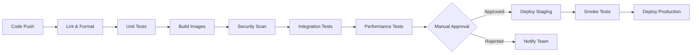

# CI/CD Pipeline Strategy

## Overview

This document outlines our continuous integration and continuous deployment (CI/CD) strategy for the OHLCV RAG System, covering automated testing, building, security scanning, and deployment workflows.

## Table of Contents

1. [Pipeline Architecture](#pipeline-architecture)
2. [GitHub Actions Workflows](#github-actions-workflows)
3. [Automated Testing Strategy](#automated-testing-strategy)
4. [Docker Build Pipeline](#docker-build-pipeline)
5. [Security Scanning](#security-scanning)
6. [Deployment Automation](#deployment-automation)
7. [Release Management](#release-management)
8. [Rollback Strategy](#rollback-strategy)
9. [Performance Testing](#performance-testing)
10. [Monitoring Integration](#monitoring-integration)

## Pipeline Architecture

### Pipeline Stages



### Pipeline Configuration

```yaml
# .github/workflows/main-pipeline.yml
name: Main CI/CD Pipeline

on:
  push:
    branches: [main, develop]
  pull_request:
    branches: [main]
  workflow_dispatch:
    inputs:
      environment:
        description: 'Deployment environment'
        required: true
        default: 'staging'
        type: choice
        options:
          - staging
          - production

env:
  REGISTRY: ghcr.io
  IMAGE_NAME: ${{ github.repository }}
  PYTHON_VERSION: '3.11'
  UV_VERSION: '0.1.0'

jobs:
  # Job dependency graph
  lint:
    runs-on: ubuntu-latest
  
  test:
    needs: lint
    runs-on: ubuntu-latest
  
  build:
    needs: test
    runs-on: ubuntu-latest
  
  security:
    needs: build
    runs-on: ubuntu-latest
  
  integration:
    needs: security
    runs-on: ubuntu-latest
  
  deploy:
    needs: integration
    if: github.ref == 'refs/heads/main'
    runs-on: ubuntu-latest
```

## GitHub Actions Workflows

### Main CI/CD Workflow

```yaml
# .github/workflows/ci-cd.yml
name: CI/CD Pipeline

on:
  push:
    branches: [main, develop, 'release/**']
  pull_request:
    branches: [main]
  schedule:
    - cron: '0 2 * * *'  # Nightly builds

concurrency:
  group: ${{ github.workflow }}-${{ github.ref }}
  cancel-in-progress: true

jobs:
  # ============== Code Quality ==============
  code-quality:
    name: Code Quality Checks
    runs-on: ubuntu-latest
    steps:
      - uses: actions/checkout@v4
        with:
          fetch-depth: 0  # Full history for analysis
      
      - name: Set up Python
        uses: actions/setup-python@v4
        with:
          python-version: ${{ env.PYTHON_VERSION }}
      
      - name: Install UV
        run: |
          curl -LsSf https://astral.sh/uv/install.sh | sh
          echo "$HOME/.local/bin" >> $GITHUB_PATH
      
      - name: Cache UV packages
        uses: actions/cache@v3
        with:
          path: |
            ~/.cache/uv
            .venv
          key: uv-${{ runner.os }}-${{ hashFiles('uv.lock') }}
          restore-keys: |
            uv-${{ runner.os }}-
      
      - name: Install dependencies
        run: |
          uv sync --frozen
      
      - name: Run Black formatter
        run: |
          uv run black --check src/ tests/
      
      - name: Run Ruff linter
        run: |
          uv run ruff check src/ tests/
      
      - name: Run MyPy type checker
        run: |
          uv run mypy src/ --ignore-missing-imports
      
      - name: Check for secrets
        uses: trufflesecurity/trufflehog@main
        with:
          path: ./
          base: ${{ github.event.repository.default_branch }}
          head: HEAD
      
      - name: SonarCloud Scan
        uses: SonarSource/sonarcloud-github-action@master
        env:
          GITHUB_TOKEN: ${{ secrets.GITHUB_TOKEN }}
          SONAR_TOKEN: ${{ secrets.SONAR_TOKEN }}

  # ============== Testing ==============
  test:
    name: Run Tests
    runs-on: ubuntu-latest
    needs: code-quality
    strategy:
      matrix:
        python-version: ['3.10', '3.11', '3.12']
    services:
      postgres:
        image: postgres:15
        env:
          POSTGRES_PASSWORD: postgres
        options: >-
          --health-cmd pg_isready
          --health-interval 10s
          --health-timeout 5s
          --health-retries 5
        ports:
          - 5432:5432
      
      redis:
        image: redis:7
        options: >-
          --health-cmd "redis-cli ping"
          --health-interval 10s
          --health-timeout 5s
          --health-retries 5
        ports:
          - 6379:6379
    
    steps:
      - uses: actions/checkout@v4
      
      - name: Set up Python ${{ matrix.python-version }}
        uses: actions/setup-python@v4
        with:
          python-version: ${{ matrix.python-version }}
      
      - name: Install UV
        run: |
          curl -LsSf https://astral.sh/uv/install.sh | sh
          echo "$HOME/.local/bin" >> $GITHUB_PATH
      
      - name: Install dependencies
        run: |
          uv sync --frozen
      
      - name: Run unit tests
        run: |
          uv run pytest tests/unit/ \
            --cov=src \
            --cov-report=xml \
            --cov-report=html \
            --junitxml=test-results/junit.xml \
            -v
      
      - name: Run integration tests
        run: |
          uv run pytest tests/integration/ \
            --cov=src \
            --cov-append \
            --cov-report=xml \
            -v
      
      - name: Upload coverage to Codecov
        uses: codecov/codecov-action@v3
        with:
          file: ./coverage.xml
          flags: unittests
          name: codecov-${{ matrix.python-version }}
      
      - name: Upload test results
        uses: actions/upload-artifact@v3
        if: always()
        with:
          name: test-results-${{ matrix.python-version }}
          path: test-results/

  # ============== Docker Build ==============
  build-docker:
    name: Build Docker Images
    runs-on: ubuntu-latest
    needs: test
    permissions:
      contents: read
      packages: write
    strategy:
      matrix:
        target: [runtime, development, production, test]
    
    steps:
      - uses: actions/checkout@v4
      
      - name: Set up Docker Buildx
        uses: docker/setup-buildx-action@v3
        with:
          driver-opts: |
            network=host
            image=moby/buildkit:master
      
      - name: Log in to GitHub Container Registry
        uses: docker/login-action@v3
        with:
          registry: ${{ env.REGISTRY }}
          username: ${{ github.actor }}
          password: ${{ secrets.GITHUB_TOKEN }}
      
      - name: Extract metadata
        id: meta
        uses: docker/metadata-action@v5
        with:
          images: ${{ env.REGISTRY }}/${{ env.IMAGE_NAME }}
          tags: |
            type=ref,event=branch
            type=ref,event=pr
            type=semver,pattern={{version}}
            type=semver,pattern={{major}}.{{minor}}
            type=sha,prefix={{branch}}-
            type=raw,value=${{ matrix.target }}-latest
      
      - name: Cache Docker layers
        uses: actions/cache@v3
        with:
          path: /tmp/.buildx-cache
          key: ${{ runner.os }}-buildx-${{ matrix.target }}-${{ github.sha }}
          restore-keys: |
            ${{ runner.os }}-buildx-${{ matrix.target }}-
            ${{ runner.os }}-buildx-
      
      - name: Build and push Docker image
        uses: docker/build-push-action@v5
        with:
          context: .
          file: Dockerfile.optimized
          target: ${{ matrix.target }}
          push: ${{ github.event_name != 'pull_request' }}
          tags: ${{ steps.meta.outputs.tags }}
          labels: ${{ steps.meta.outputs.labels }}
          cache-from: |
            type=local,src=/tmp/.buildx-cache
            type=registry,ref=${{ env.REGISTRY }}/${{ env.IMAGE_NAME }}:buildcache-${{ matrix.target }}
          cache-to: |
            type=local,dest=/tmp/.buildx-cache-new,mode=max
            type=registry,ref=${{ env.REGISTRY }}/${{ env.IMAGE_NAME }}:buildcache-${{ matrix.target }},mode=max
          build-args: |
            BUILDKIT_INLINE_CACHE=1
            UV_CONCURRENT_DOWNLOADS=10
            UV_CONCURRENT_BUILDS=4
            BUILD_DATE=${{ github.event.head_commit.timestamp }}
            VCS_REF=${{ github.sha }}
            VERSION=${{ github.ref_name }}
          platforms: linux/amd64,linux/arm64
      
      - name: Move cache
        run: |
          rm -rf /tmp/.buildx-cache
          mv /tmp/.buildx-cache-new /tmp/.buildx-cache

  # ============== Security Scanning ==============
  security-scan:
    name: Security Scanning
    runs-on: ubuntu-latest
    needs: build-docker
    permissions:
      contents: read
      security-events: write
    
    steps:
      - uses: actions/checkout@v4
      
      - name: Run Trivy vulnerability scanner
        uses: aquasecurity/trivy-action@master
        with:
          image-ref: ${{ env.REGISTRY }}/${{ env.IMAGE_NAME }}:${{ github.sha }}
          format: 'sarif'
          output: 'trivy-results.sarif'
          severity: 'CRITICAL,HIGH,MEDIUM'
          vuln-type: 'os,library'
      
      - name: Upload Trivy results to GitHub Security
        uses: github/codeql-action/upload-sarif@v2
        with:
          sarif_file: 'trivy-results.sarif'
      
      - name: Run Snyk security scan
        uses: snyk/actions/docker@master
        env:
          SNYK_TOKEN: ${{ secrets.SNYK_TOKEN }}
        with:
          image: ${{ env.REGISTRY }}/${{ env.IMAGE_NAME }}:${{ github.sha }}
          args: --severity-threshold=medium
      
      - name: OWASP Dependency Check
        uses: dependency-check/Dependency-Check_Action@main
        with:
          project: 'ohlcv-rag'
          path: '.'
          format: 'ALL'
          args: >
            --enableRetired
            --enableExperimental
      
      - name: Upload OWASP results
        uses: actions/upload-artifact@v3
        with:
          name: dependency-check-report
          path: reports/

  # ============== Performance Testing ==============
  performance-test:
    name: Performance Testing
    runs-on: ubuntu-latest
    needs: security-scan
    if: github.event_name == 'push' && github.ref == 'refs/heads/main'
    
    steps:
      - uses: actions/checkout@v4
      
      - name: Set up K6
        run: |
          sudo apt-key adv --keyserver hkp://keyserver.ubuntu.com:80 --recv-keys C5AD17C747E3415A3642D57D77C6C491D6AC1D69
          echo "deb https://dl.k6.io/deb stable main" | sudo tee /etc/apt/sources.list.d/k6.list
          sudo apt-get update
          sudo apt-get install k6
      
      - name: Start application
        run: |
          docker run -d \
            --name ohlcv-app \
            -p 8000:8000 \
            ${{ env.REGISTRY }}/${{ env.IMAGE_NAME }}:${{ github.sha }}
          
          # Wait for app to be ready
          timeout 60 bash -c 'until curl -f http://localhost:8000/health; do sleep 1; done'
      
      - name: Run load tests
        run: |
          k6 run tests/performance/load-test.js \
            --out json=test-results/k6-results.json \
            --summary-export=test-results/k6-summary.json
      
      - name: Run stress tests
        run: |
          k6 run tests/performance/stress-test.js \
            --out json=test-results/k6-stress.json
      
      - name: Analyze results
        run: |
          python scripts/analyze-performance.py test-results/k6-results.json
      
      - name: Upload performance results
        uses: actions/upload-artifact@v3
        with:
          name: performance-results
          path: test-results/

  # ============== Deployment ==============
  deploy-staging:
    name: Deploy to Staging
    runs-on: ubuntu-latest
    needs: [security-scan, performance-test]
    if: github.ref == 'refs/heads/develop'
    environment:
      name: staging
      url: https://staging.ohlcv.example.com
    
    steps:
      - uses: actions/checkout@v4
      
      - name: Deploy to Kubernetes (Staging)
        run: |
          # Set up kubectl
          echo "${{ secrets.KUBE_CONFIG_STAGING }}" | base64 -d > kubeconfig
          export KUBECONFIG=$(pwd)/kubeconfig
          
          # Update deployment
          kubectl set image deployment/ohlcv-rag \
            app=${{ env.REGISTRY }}/${{ env.IMAGE_NAME }}:${{ github.sha }} \
            -n ohlcv-staging
          
          # Wait for rollout
          kubectl rollout status deployment/ohlcv-rag -n ohlcv-staging
          
          # Run smoke tests
          ./scripts/smoke-tests.sh staging

  deploy-production:
    name: Deploy to Production
    runs-on: ubuntu-latest
    needs: deploy-staging
    if: github.ref == 'refs/heads/main'
    environment:
      name: production
      url: https://api.ohlcv.example.com
    
    steps:
      - uses: actions/checkout@v4
      
      - name: Create deployment
        uses: actions/github-script@v6
        with:
          script: |
            const deployment = await github.rest.repos.createDeployment({
              owner: context.repo.owner,
              repo: context.repo.repo,
              ref: context.sha,
              environment: 'production',
              required_contexts: [],
              auto_merge: false
            });
            
            core.setOutput('deployment_id', deployment.data.id);
      
      - name: Deploy to Kubernetes (Production)
        id: deploy
        run: |
          # Blue-Green Deployment
          echo "${{ secrets.KUBE_CONFIG_PROD }}" | base64 -d > kubeconfig
          export KUBECONFIG=$(pwd)/kubeconfig
          
          # Deploy to green environment
          kubectl set image deployment/ohlcv-rag-green \
            app=${{ env.REGISTRY }}/${{ env.IMAGE_NAME }}:${{ github.sha }} \
            -n ohlcv-production
          
          # Wait for green deployment
          kubectl rollout status deployment/ohlcv-rag-green -n ohlcv-production
          
          # Run smoke tests on green
          ./scripts/smoke-tests.sh production-green
          
          # Switch traffic to green
          kubectl patch service ohlcv-rag \
            -p '{"spec":{"selector":{"version":"green"}}}' \
            -n ohlcv-production
          
          # Update blue with new image for next deployment
          kubectl set image deployment/ohlcv-rag-blue \
            app=${{ env.REGISTRY }}/${{ env.IMAGE_NAME }}:${{ github.sha }} \
            -n ohlcv-production
      
      - name: Update deployment status
        uses: actions/github-script@v6
        if: always()
        with:
          script: |
            await github.rest.repos.createDeploymentStatus({
              owner: context.repo.owner,
              repo: context.repo.repo,
              deployment_id: ${{ steps.create_deployment.outputs.deployment_id }},
              state: '${{ job.status }}',
              environment_url: 'https://api.ohlcv.example.com',
              description: 'Deployment ${{ job.status }}'
            });
```

## Automated Testing Strategy

### Test Configuration

```yaml
# tests/performance/load-test.js
import http from 'k6/http';
import { check, sleep } from 'k6';
import { Rate } from 'k6/metrics';

const errorRate = new Rate('errors');

export const options = {
  stages: [
    { duration: '2m', target: 10 },   // Ramp up
    { duration: '5m', target: 10 },   // Stay at 10 users
    { duration: '2m', target: 50 },   // Ramp to 50 users
    { duration: '5m', target: 50 },   // Stay at 50 users
    { duration: '2m', target: 0 },    // Ramp down
  ],
  thresholds: {
    http_req_duration: ['p(95)<500'],  // 95% of requests under 500ms
    errors: ['rate<0.1'],               // Error rate under 10%
    http_req_failed: ['rate<0.1'],     // HTTP failure rate under 10%
  },
};

export default function () {
  const payload = JSON.stringify({
    query: 'What is the latest OHLCV data for AAPL?',
    context: 'financial analysis',
  });

  const params = {
    headers: {
      'Content-Type': 'application/json',
      'Authorization': `Bearer ${__ENV.API_TOKEN}`,
    },
    timeout: '10s',
  };

  const response = http.post('http://localhost:8000/api/query', payload, params);
  
  const success = check(response, {
    'status is 200': (r) => r.status === 200,
    'response time < 500ms': (r) => r.timings.duration < 500,
    'response has data': (r) => JSON.parse(r.body).data !== undefined,
  });

  errorRate.add(!success);
  sleep(1);
}
```

### Integration Test Suite

```python
# tests/integration/test_pipeline.py
import pytest
import asyncio
from testcontainers.compose import DockerCompose
from testcontainers.postgres import PostgresContainer
from testcontainers.redis import RedisContainer

@pytest.fixture(scope="session")
def docker_compose():
    with DockerCompose(".", compose_file_name="docker-compose.test.yml") as compose:
        compose.wait_for("http://localhost:8000/health")
        yield compose

@pytest.mark.integration
class TestPipeline:
    def test_end_to_end_query(self, docker_compose):
        """Test complete query pipeline"""
        response = requests.post(
            "http://localhost:8000/api/query",
            json={"query": "Test query"},
            timeout=10
        )
        assert response.status_code == 200
        assert "result" in response.json()
    
    def test_concurrent_requests(self, docker_compose):
        """Test system under concurrent load"""
        async def make_request():
            async with aiohttp.ClientSession() as session:
                async with session.post(
                    "http://localhost:8000/api/query",
                    json={"query": "Concurrent test"}
                ) as response:
                    return await response.json()
        
        async def run_concurrent():
            tasks = [make_request() for _ in range(50)]
            results = await asyncio.gather(*tasks)
            return results
        
        results = asyncio.run(run_concurrent())
        assert len(results) == 50
        assert all(r.get("status") == "success" for r in results)
```

## Docker Build Pipeline

### Multi-stage Build Optimization

```dockerfile
# Dockerfile.ci
# CI-specific optimizations
FROM python:3.11-slim AS ci-base

# Install CI dependencies
RUN apt-get update && apt-get install -y \
    git \
    curl \
    && rm -rf /var/lib/apt/lists/*

# Install UV for fast dependency management
RUN curl -LsSf https://astral.sh/uv/install.sh | sh
ENV PATH="/root/.local/bin:${PATH}"

# Cache mount for CI
RUN --mount=type=cache,target=/root/.cache/uv,sharing=locked \
    --mount=type=cache,target=/tmp/.uv,sharing=locked \
    --mount=type=bind,source=pyproject.toml,target=pyproject.toml \
    --mount=type=bind,source=uv.lock,target=uv.lock \
    UV_CONCURRENT_DOWNLOADS=10 \
    UV_CONCURRENT_BUILDS=4 \
    uv sync --frozen --no-install-project

# Test stage
FROM ci-base AS test
WORKDIR /app
COPY . .
RUN uv sync --frozen
CMD ["uv", "run", "pytest", "-v"]
```

### Build Script

```bash
#!/bin/bash
# scripts/ci-build.sh

set -euo pipefail

# Configuration
REGISTRY="${REGISTRY:-ghcr.io}"
IMAGE_NAME="${IMAGE_NAME:-ohlcv-rag}"
BUILD_DATE=$(date -u +'%Y-%m-%dT%H:%M:%SZ')
VCS_REF=$(git rev-parse --short HEAD)
VERSION="${VERSION:-${GITHUB_REF_NAME:-dev}}"

# Enable BuildKit
export DOCKER_BUILDKIT=1
export BUILDKIT_PROGRESS=plain

# Build function
build_image() {
    local target=$1
    local tag=$2
    
    echo "Building ${target} image with tag ${tag}"
    
    docker build \
        --target "${target}" \
        --tag "${REGISTRY}/${IMAGE_NAME}:${tag}" \
        --build-arg BUILDKIT_INLINE_CACHE=1 \
        --build-arg BUILD_DATE="${BUILD_DATE}" \
        --build-arg VCS_REF="${VCS_REF}" \
        --build-arg VERSION="${VERSION}" \
        --cache-from "${REGISTRY}/${IMAGE_NAME}:buildcache-${target}" \
        --cache-from "${REGISTRY}/${IMAGE_NAME}:${target}-latest" \
        -f Dockerfile.optimized \
        .
}

# Build all targets in parallel
build_image "runtime" "${VERSION}" &
build_image "development" "${VERSION}-dev" &
build_image "production" "${VERSION}-prod" &
build_image "test" "${VERSION}-test" &

# Wait for all builds
wait

echo "All builds completed successfully"
```

## Security Scanning

### Security Policy

```yaml
# .github/security-policy.yml
security:
  vulnerabilities:
    critical:
      action: block
      notify: security-team
    high:
      action: warn
      review_required: true
    medium:
      action: log
    low:
      action: ignore
  
  secrets:
    scan_on: [push, pull_request]
    patterns:
      - 'api[_-]?key'
      - 'secret'
      - 'token'
      - 'password'
    exclude_paths:
      - '**/*.md'
      - 'docs/**'
  
  dependencies:
    auto_update: true
    update_schedule: weekly
    vulnerability_alerts: true
```

### Container Scanning

```yaml
# .github/workflows/security.yml
name: Security Scanning

on:
  schedule:
    - cron: '0 0 * * *'  # Daily scan
  workflow_dispatch:

jobs:
  scan-containers:
    runs-on: ubuntu-latest
    steps:
      - name: Scan with Grype
        run: |
          curl -sSfL https://raw.githubusercontent.com/anchore/grype/main/install.sh | sh -s -- -b /usr/local/bin
          grype ${REGISTRY}/${IMAGE_NAME}:latest \
            --fail-on high \
            --output json \
            --file grype-report.json
      
      - name: Scan with Clair
        run: |
          docker run --rm \
            -v /var/run/docker.sock:/var/run/docker.sock \
            arminc/clair-scanner \
            --ip $(hostname -I | awk '{print $1}') \
            ${REGISTRY}/${IMAGE_NAME}:latest
      
      - name: Upload scan results
        uses: actions/upload-artifact@v3
        with:
          name: security-scan-results
          path: |
            grype-report.json
            clair-report.json
```

## Deployment Automation

### Helm Chart Configuration

```yaml
# helm/ohlcv-rag/values.yaml
replicaCount: 3

image:
  repository: ghcr.io/ohlcv/ohlcv-rag
  pullPolicy: IfNotPresent
  tag: ""  # Overridden by CI/CD

imagePullSecrets:
  - name: ghcr-secret

serviceAccount:
  create: true
  annotations: {}
  name: ""

service:
  type: ClusterIP
  port: 80
  targetPort: 8000

ingress:
  enabled: true
  className: nginx
  annotations:
    cert-manager.io/cluster-issuer: letsencrypt-prod
    nginx.ingress.kubernetes.io/rate-limit: "100"
  hosts:
    - host: api.ohlcv.example.com
      paths:
        - path: /
          pathType: Prefix
  tls:
    - secretName: ohlcv-tls
      hosts:
        - api.ohlcv.example.com

resources:
  limits:
    cpu: 2000m
    memory: 2Gi
  requests:
    cpu: 500m
    memory: 512Mi

autoscaling:
  enabled: true
  minReplicas: 2
  maxReplicas: 10
  targetCPUUtilizationPercentage: 70
  targetMemoryUtilizationPercentage: 80

strategy:
  type: RollingUpdate
  rollingUpdate:
    maxSurge: 1
    maxUnavailable: 0
```

### Deployment Script

```bash
#!/bin/bash
# scripts/deploy.sh

set -euo pipefail

# Configuration
ENVIRONMENT="${1:-staging}"
NAMESPACE="ohlcv-${ENVIRONMENT}"
RELEASE_NAME="ohlcv-rag"
CHART_PATH="./helm/ohlcv-rag"
VALUES_FILE="./helm/values-${ENVIRONMENT}.yaml"

# Colors
RED='\033[0;31m'
GREEN='\033[0;32m'
YELLOW='\033[1;33m'
NC='\033[0m'

log() {
    echo -e "${GREEN}[$(date '+%Y-%m-%d %H:%M:%S')]${NC} $1"
}

error() {
    echo -e "${RED}[ERROR]${NC} $1" >&2
    exit 1
}

# Pre-deployment checks
log "Running pre-deployment checks..."

# Check kubectl connection
kubectl cluster-info &>/dev/null || error "Cannot connect to Kubernetes cluster"

# Check namespace exists
kubectl get namespace "${NAMESPACE}" &>/dev/null || \
    kubectl create namespace "${NAMESPACE}"

# Create image pull secret if needed
kubectl create secret docker-registry ghcr-secret \
    --docker-server=ghcr.io \
    --docker-username="${GITHUB_ACTOR}" \
    --docker-password="${GITHUB_TOKEN}" \
    --namespace="${NAMESPACE}" \
    --dry-run=client -o yaml | kubectl apply -f -

# Run Helm diff
log "Checking deployment changes..."
helm diff upgrade \
    --install \
    --namespace "${NAMESPACE}" \
    --values "${VALUES_FILE}" \
    "${RELEASE_NAME}" \
    "${CHART_PATH}"

# Deploy with Helm
log "Deploying to ${ENVIRONMENT}..."
helm upgrade \
    --install \
    --namespace "${NAMESPACE}" \
    --values "${VALUES_FILE}" \
    --set image.tag="${IMAGE_TAG}" \
    --wait \
    --timeout 10m \
    --atomic \
    "${RELEASE_NAME}" \
    "${CHART_PATH}"

# Verify deployment
log "Verifying deployment..."
kubectl rollout status deployment/"${RELEASE_NAME}" -n "${NAMESPACE}"

# Run smoke tests
log "Running smoke tests..."
./scripts/smoke-tests.sh "${ENVIRONMENT}"

log "Deployment to ${ENVIRONMENT} completed successfully!"
```

## Release Management

### Semantic Versioning

```yaml
# .github/workflows/release.yml
name: Release

on:
  push:
    tags:
      - 'v*'

jobs:
  release:
    runs-on: ubuntu-latest
    steps:
      - uses: actions/checkout@v4
        with:
          fetch-depth: 0
      
      - name: Generate changelog
        id: changelog
        uses: mikepenz/release-changelog-builder-action@v3
        with:
          configuration: ".github/changelog-config.json"
        env:
          GITHUB_TOKEN: ${{ secrets.GITHUB_TOKEN }}
      
      - name: Create Release
        uses: actions/create-release@v1
        env:
          GITHUB_TOKEN: ${{ secrets.GITHUB_TOKEN }}
        with:
          tag_name: ${{ github.ref }}
          release_name: Release ${{ github.ref }}
          body: ${{ steps.changelog.outputs.changelog }}
          draft: false
          prerelease: ${{ contains(github.ref, '-rc') }}
      
      - name: Publish to PyPI
        run: |
          uv build
          uv publish \
            --username __token__ \
            --password ${{ secrets.PYPI_TOKEN }}
```

## Rollback Strategy

### Automatic Rollback

```yaml
# kubernetes/rollback-policy.yaml
apiVersion: flagger.app/v1beta1
kind: Canary
metadata:
  name: ohlcv-rag
  namespace: ohlcv-production
spec:
  targetRef:
    apiVersion: apps/v1
    kind: Deployment
    name: ohlcv-rag
  service:
    port: 80
    targetPort: 8000
  analysis:
    interval: 1m
    threshold: 10
    maxWeight: 50
    stepWeight: 10
    metrics:
    - name: request-success-rate
      thresholdRange:
        min: 99
      interval: 1m
    - name: request-duration
      thresholdRange:
        max: 500
      interval: 30s
    webhooks:
    - name: load-test
      url: http://flagger-loadtester.test/
      timeout: 5s
      metadata:
        cmd: "hey -z 1m -q 10 -c 2 http://ohlcv-rag-canary.ohlcv-production:80/"
    - name: smoke-test
      url: http://flagger-loadtester.test/
      timeout: 60s
      metadata:
        type: bash
        cmd: "curl -f http://ohlcv-rag-canary.ohlcv-production:80/health"
```

### Manual Rollback

```bash
#!/bin/bash
# scripts/rollback.sh

# Get current revision
CURRENT_REVISION=$(kubectl rollout history deployment/ohlcv-rag -n ohlcv-production | tail -2 | head -1 | awk '{print $1}')

# Rollback to previous revision
kubectl rollout undo deployment/ohlcv-rag \
    --to-revision=$((CURRENT_REVISION-1)) \
    -n ohlcv-production

# Wait for rollback
kubectl rollout status deployment/ohlcv-rag -n ohlcv-production

# Verify health
curl -f https://api.ohlcv.example.com/health || exit 1

echo "Rollback completed successfully"
```

## Performance Testing

### Load Test Script

```javascript
// tests/performance/stress-test.js
import http from 'k6/http';
import { check } from 'k6';

export const options = {
  stages: [
    { duration: '5m', target: 100 },   // Ramp to 100 users
    { duration: '10m', target: 100 },  // Stay at 100
    { duration: '5m', target: 200 },   // Ramp to 200
    { duration: '10m', target: 200 },  // Stay at 200
    { duration: '5m', target: 0 },     // Ramp down
  ],
  thresholds: {
    http_req_duration: ['p(99)<1000'], // 99% under 1s
    http_req_failed: ['rate<0.05'],    // Error rate under 5%
  },
};

export default function () {
  const response = http.get('http://localhost:8000/api/health');
  check(response, {
    'status is 200': (r) => r.status === 200,
  });
}
```

## Monitoring Integration

### Deployment Metrics

```python
# metrics/deployment.py
from prometheus_client import Counter, Histogram, Gauge

deployment_total = Counter(
    'deployments_total',
    'Total number of deployments',
    ['environment', 'status']
)

deployment_duration = Histogram(
    'deployment_duration_seconds',
    'Deployment duration in seconds',
    ['environment']
)

deployment_rollback = Counter(
    'deployment_rollbacks_total',
    'Total number of rollbacks',
    ['environment', 'reason']
)

current_version = Gauge(
    'deployment_info',
    'Current deployment information',
    ['environment', 'version', 'commit']
)
```

## Best Practices

1. **Fail Fast**: Catch issues early in the pipeline
2. **Parallel Execution**: Run independent jobs concurrently
3. **Cache Everything**: Dependencies, Docker layers, test results
4. **Security First**: Scan at every stage
5. **Progressive Deployment**: Staging → Canary → Production
6. **Automated Rollback**: Define clear failure criteria
7. **Comprehensive Testing**: Unit, integration, performance, security
8. **Monitoring Integration**: Track deployment metrics
9. **Documentation**: Keep pipeline documentation current
10. **Cost Optimization**: Use spot instances for non-critical jobs

## Summary

This CI/CD pipeline strategy provides:
- **Automated quality checks** with linting and testing
- **Multi-stage Docker builds** with caching
- **Comprehensive security scanning** at multiple levels
- **Progressive deployment** with automatic rollback
- **Performance testing** integrated into pipeline
- **Complete observability** of deployment process
- **Fast feedback loops** with parallel execution